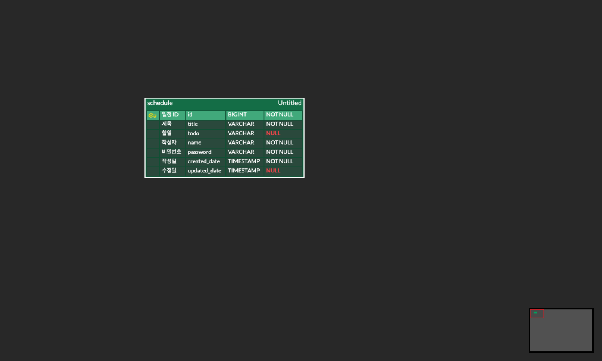

# [SPRING 6기] Calendar 과제
-----

## 프로젝트 소개
"Spring boot 사용하여 구현, DB에 저장하고 불러오기"
***

## 프로젝트 개발 기간
'2025. 03. 19(수) ~ 2025. 03. 26(수)"
***

## 프로젝트 프래그램 설치방법 및 환경세팅
1. JDK 버전 17
***

## 주요 기능
* 일정 등록하기 (@RequestBody 어노테이션을 활용하여 DB에 저장)
* 등록 시 id 값은 Auto Increment 를 사용하여 기존 id 값에서 1씩 증가하도록 설계
* 모든 일정 조회 (DB에 저장된 모든 일정을 조회하는 기능 구현)
* 단건 일정 조회 (DB에 저장된 하나의 일정을 조회하는 기능 구현 - DB에 접근할 때 id 값을 PK로 설정하여 id값에 해당하는 컬럼들 가져오기)
* 일정 수정하기 (@RequestBody 로 입력 받은 비밀번호가 DB에 저장된 비밀번호와 일치하는지 검증하는 로직 구현 - 만일 일치하지 않다면 오루 메시지 날리기)
* 일정 삭제하기 (@RequestBody 로 입력 받은 비밀번호가 DB에 저장된 비밀번호와 일치하는지 검증하는 로직 구현 - 만일 일치하지 않다면 오루 메시지 날리기)
* 입력한 숫자에 해당하는 MenuItem 리스트 출력(Menu 클래스에서 MenuItem 클래스에 접근하여 저장된 값 받아오기)
***

## API 명세서
|기능|Method|URL|Request|Response|Status Code|
|:---|:---|:---|:---|:---|:---|
|일정 등록|POST|/schedules|{"title": "제목","todo": "할일","name": "작성자","password": 1234}|{"id": 1,"title": "제목","todo": "할일","name": "작성자","createDate": "YYYY-mm-dd T HH:MM:SS","updatedDate": "YYYY-mm-dd T HH:MM:SS"}|201 Created|
|일정 목록 조회|GET|/schedules||[{"id": 1,"title": "제목","todo": "할일","name": "작성자","createDate": "YYYY-mm-dd T HH:MM:SS","updatedDate": "YYYY-mm-dd T HH:MM:SS"}]|200 OK|
|일정 단건 조회|GET|/schedule/{id}||{"id": 1,"title": "제목","todo": "수정 내용2","name": "수정 이름2","createDate": "YYYY-mm-dd T HH:MM:SS","updatedDate": "YYYY-mm-dd T HH:MM:SS"}|200 OK|
|일정 수정|PUT|/schedule/{id}|{"todo": "수정 내용","name": "수정 이름","password": 1234}|{"id": 1,"title": "제목","todo": "수정 내용","name": "수정 이름","createDate": "YYYY-mm-dd T HH:MM:SS","updatedDate": "YYYY-mm-dd T HH:MM:SS"}|200 OK|
|일정 삭제|DELETE|/schedule/{id}|{"password": 1234}||200 OK|
***

## ERD

***

## 트러블 슈팅
* 
***

## 결과 및 성과
* Spring 에서 사용하는 어노테이션 사용법
* Dto 형태의 객체로 값을 넘겨주고, 값을 넘겨받는 방법
* @RequestBody를 활용해 DB에 접근하여 정보 저장하는 방법
* Spring boot에 대해 조금의 이해
